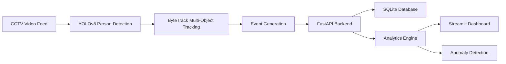

# Store Intelligence System 🏪


An end-to-end retail analytics pipeline that processes CCTV footage to generate real-time metrics, visitor funnels, and anomaly alerts.

## 🏗️ Architecture Diagram



## 🔄 System Workflow

* **Step 1**: CCTV footage is processed by YOLOv8.
* **Step 2**: ByteTrack maintains visitor identities.
* **Step 3**: Events are generated and sent to FastAPI.
* **Step 4**: Metrics and analytics are calculated.
* **Step 5**: Dashboard visualizes KPIs in real time.
* **Step 6**: Anomaly engine generates operational alerts.

## 🎯 Challenge Requirements Mapping

| Requirement         | Implementation   |
| ------------------- | ---------------- |
| Person Detection    | YOLOv8           |
| Tracking            | ByteTrack        |
| Event Pipeline      | pipeline/emit.py |
| Metrics API         | FastAPI          |
| Dashboard           | Streamlit        |
| Real-Time Analytics | Implemented      |
| Docker Deployment   | Implemented      |
| Testing             | Pytest           |

## 💼 Business Impact

* **Queue management optimization**: Detects queue spikes in real-time to alert managers to open more registers.
* **Customer conversion analysis**: Tracks the complete funnel from store entry to purchase, allowing targeted improvements to reduce abandonment.
* **Store layout optimization through heatmaps**: Identifies high-traffic and low-traffic zones to optimize product placement.
* **Staffing and operational insights**: Excludes staff from analytics to provide pure customer metrics, helping align staffing schedules with actual foot traffic.
* **Real-time anomaly detection**: Instantly flags unusual behavior, such as massive crowds or sudden abandonment, enabling immediate operational response.

## 💡 Why This Solution?

The Store Intelligence System bridges the gap between passive video surveillance and actionable retail intelligence. By processing existing CCTV footage without requiring expensive specialized hardware, it empowers retail businesses to make data-driven decisions. Store managers can instantly identify bottlenecks, optimize product placements based on actual customer dwell times, and improve overall customer satisfaction through proactive queue management.

## 🌟 Key Features

* **Real-time visitor tracking**: Maintains unique identities across camera frames using advanced ByteTrack algorithms.
* **Conversion funnel analytics**: Visualizes the exact drop-off rates from entry, to queue joining, to final purchase.
* **Zone heatmaps**: Generates activity scores and dwell times for distinct store areas.
* **Queue monitoring**: Tracks active queue depth and alerts on abandonment.
* **Anomaly detection**: Automated alerts for unusual store activity or crowding.
* **REST APIs**: Fully documented, idempotent endpoints for seamless integration.
* **Dockerized deployment**: Production-ready setup requiring zero local environment configuration.

## 🛠️ Technology Stack

| Component | Technology | Description |
| :--- | :--- | :--- |
| **Object Detection** | YOLOv8 | High-speed, accurate person detection from CCTV frames. |
| **Object Tracking** | ByteTrack | Robust multi-object tracking to maintain visitor identities. |
| **Backend API** | FastAPI | High-performance async API for event ingestion and analytics. |
| **Database** | SQLite | Lightweight, zero-config database with WAL for fast writes. |
| **Frontend UI** | Streamlit | Real-time, interactive dashboard for data visualization. |
| **Deployment** | Docker Compose | Containerized orchestration for easy one-command setup. |
| **Language** | Python 3.11 | Core programming language for all microservices. |

## 🚀 One-Command Deployment

The entire system (API, Pipeline, Dashboard) runs via Docker Compose:

```bash
docker compose up --build
```

*Note: Ensure you have your CCTV clips (.mp4) in the `/data/videos` volume or use the provided cameras.*

## 🏗️ Repository Structure

```text
store-intelligence/
├── pipeline/          # Computer Vision Layer (YOLOv8 + ByteTrack)
├── app/               # FastAPI Backend (Metrics, Funnel, Heatmap)
├── dashboard/         # Streamlit Dashboard (Live KPI Feed)
├── tests/             # Pytest Suite (>70% coverage)
├── docs/              # Design and Technical Choices
└── docker-compose.yml # Orchestration
```

## 🛠️ API Endpoints

-   `POST /events/ingest`: Ingest visitor events (idempotent).
-   `GET /stores/{id}/metrics`: Fetch unique visitors, conversion rate, etc.
-   `GET /stores/{id}/funnel`: Conversion funnel (Entry → Queue → Purchase).
-   `GET /stores/{id}/heatmap`: Zone activity and dwell time.
-   `GET /stores/{id}/anomalies`: Active alerts (Queue Spikes, etc.).
-   `GET /health`: Service and feed health status.

## 🧪 Testing

Run the comprehensive test suite locally:

```bash
pip install -r requirements.txt
pytest tests/ -v --cov=app --cov=pipeline
```

## 📈 Dashboard Features

-   **Real-time KPIs**: Visitor counts, conversion rates, and queue depth.
-   **Visitor Funnel**: Visual representation of the customer journey.
-   **Zone Heatmap**: Activity scores per store area.
-   **Anomaly Alerts**: Live notification of critical events like queue spikes.

## 🔮 Future Enhancements

* Multi-camera tracking
* Cross-store analytics
* Predictive queue forecasting
* Customer segmentation
* Cloud deployment

## 📄 Documentation

-   [Architecture Design](docs/DESIGN.md)
-   [Technical Choices](docs/CHOICES.md)

## 📸 Screenshots

### Dashboard Analytics


The real-time analytics dashboard displaying visitor count, conversion rate, queue depth, abandonment rate, visitor funnel, heatmap, and dwell-time metrics.

### Health API Status


Health monitoring endpoint showing service status, event count, and system availability.

### Swagger API Documentation – Overview


Interactive FastAPI documentation with all available endpoints.

### Swagger API Documentation – Endpoints


Detailed API endpoint specifications for ingestion, analytics, funnel metrics, anomalies, and health monitoring.

## ✅ Demo Results

- Total Events Processed: **51+**
- Unique Visitors Detected: **9**
- Conversion Rate: **22.2%**
- Queue Depth: **2**
- Abandonment Rate: **75.0%**
- YOLOv8 Person Detection: **Working**
- ByteTrack Tracking: **Working**
- Real-Time Analytics Dashboard: **Working**
- Docker Deployment: **Successful**

## 🗃️ Sample Data

A sample data file `sample_events.jsonl` is included in the root directory. 
- **Contents**: It contains 20 realistic retail analytics events representing a complete customer journey (Entry → Zone Dwell → Billing Queue → Purchase → Exit) across multiple visitors, including a non-converting visitor.
- **Pipeline Relation**: This file perfectly matches the Pydantic schemas expected by the FastAPI ingestion layer (`POST /events/ingest`). It represents the structured output that the YOLOv8 + ByteTrack computer vision pipeline (`pipeline/emit.py`) produces and sends to the backend.
- **Usage for Reviewers**: Reviewers can use this file to test the ingestion API directly without running the full video inference pipeline. For example, using curl:
  ```bash
  curl -X POST http://localhost:8000/events/ingest \
       -H "Content-Type: application/json" \
       -d "{\"events\": [$(cat sample_events.jsonl | sed -e 's/$/,/' | tr -d '\n' | sed 's/,$//')]}"
  ```
