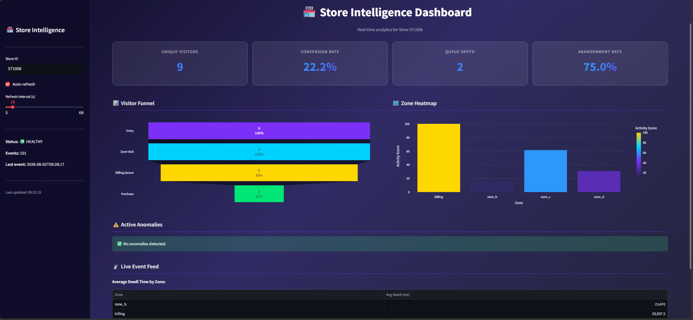
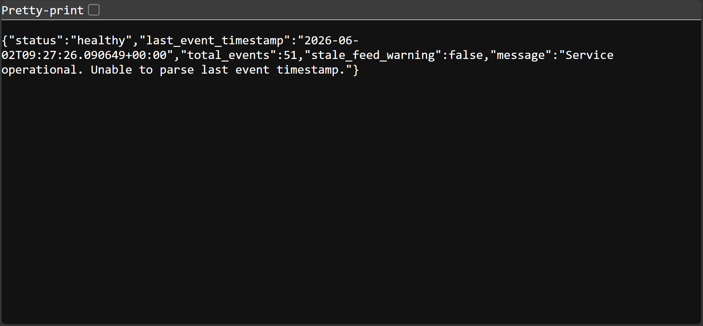
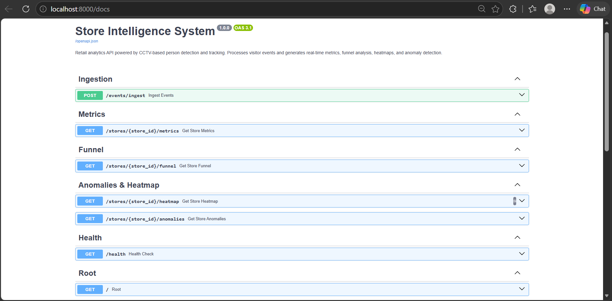
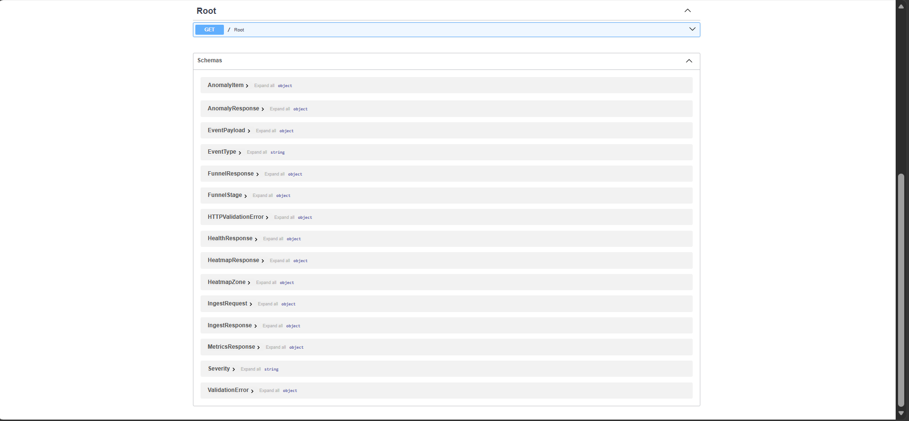

# Store Intelligence System 🏪

An end-to-end retail analytics pipeline that processes CCTV footage to generate real-time metrics, visitor funnels, and anomaly alerts.

## 🚀 One-Command Deployment

The entire system (API, Pipeline, Dashboard) runs via Docker Compose:

```bash
docker compose up --build
```

*Note: Ensure you have your CCTV clips (.mp4) in the `/data/videos` volume or use the provided cameras.*

## 🏗️ Repository Structure

```text
store-intelligence/
├── pipeline/          # Computer Vision Layer (YOLOv8 + ByteTrack)
├── app/               # FastAPI Backend (Metrics, Funnel, Heatmap)
├── dashboard/         # Streamlit Dashboard (Live KPI Feed)
├── tests/             # Pytest Suite (>70% coverage)
├── docs/              # Design and Technical Choices
└── docker-compose.yml # Orchestration
```

## 🛠️ API Endpoints

-   `POST /events/ingest`: Ingest visitor events (idempotent).
-   `GET /stores/{id}/metrics`: Fetch unique visitors, conversion rate, etc.
-   `GET /stores/{id}/funnel`: Conversion funnel (Entry → Queue → Purchase).
-   `GET /stores/{id}/heatmap`: Zone activity and dwell time.
-   `GET /stores/{id}/anomalies`: Active alerts (Queue Spikes, etc.).
-   `GET /health`: Service and feed health status.

## 🧪 Testing

Run the comprehensive test suite locally:

```bash
pip install -r requirements.txt
pytest tests/ -v --cov=app --cov=pipeline
```

## 📈 Dashboard Features

-   **Real-time KPIs**: Visitor counts, conversion rates, and queue depth.
-   **Visitor Funnel**: Visual representation of the customer journey.
-   **Zone Heatmap**: Activity scores per store area.
-   **Anomaly Alerts**: Live notification of critical events like queue spikes.

## 📄 Documentation

-   [Architecture Design](docs/DESIGN.md)
-   [Technical Choices](docs/CHOICES.md)
```
## 📸 Screenshots

### Dashboard Analytics


The real-time analytics dashboard displaying visitor count, conversion rate, queue depth, abandonment rate, visitor funnel, heatmap, and dwell-time metrics.

### Health API Status


Health monitoring endpoint showing service status, event count, and system availability.

### Swagger API Documentation – Overview


Interactive FastAPI documentation with all available endpoints.

### Swagger API Documentation – Endpoints


Detailed API endpoint specifications for ingestion, analytics, funnel metrics, anomalies, and health monitoring.

## ✅ Demo Results

- Total Events Processed: **51+**
- Unique Visitors Detected: **9**
- Conversion Rate: **22.2%**
- Queue Depth: **2**
- Abandonment Rate: **75.0%**
- YOLOv8 Person Detection: **Working**
- ByteTrack Tracking: **Working**
- Real-Time Analytics Dashboard: **Working**
- Docker Deployment: **Successful**
