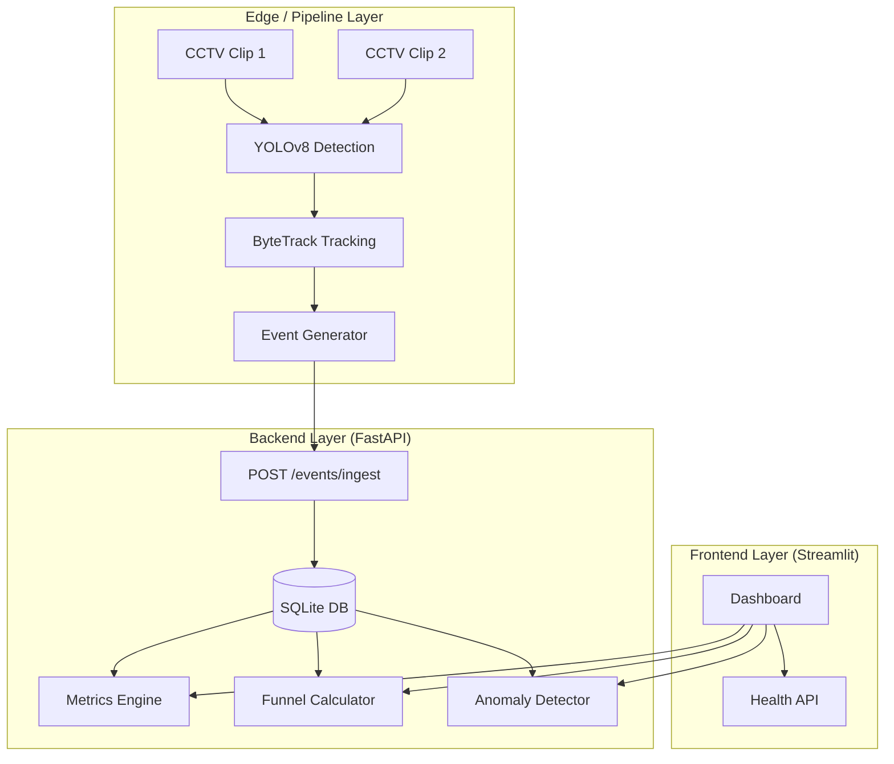

# Store Intelligence System - Design & Architecture

## System Architecture

The system follows a decoupled producer-consumer architecture:

## Data Flow

1.  **Ingestion**: Raw CCTV footage is processed by `detect.py` using YOLOv8 to find persons.
2.  **Tracking**: `tracker.py` uses ByteTrack to assign persistent IDs, allowing the system to distinguish between different visitors.
3.  **Semantic Mapping**: `emit.py` maps spatial movements to retail events (ENTRY, EXIT, ZONE_DWELL, etc.) based on pre-defined polygon zones.
4.  **Storage**: Events are sent to FastAPI via idempotent POST requests and stored in SQLite.
5.  **Analytics**: On-demand queries compute KPIs (unique visitors, conversion, abandonment) and detect anomalies using moving window statistics.

## AI-Assisted Decisions

-   **Model Choice**: YOLOv8n was chosen for the detection layer to balance latency and accuracy, enabling real-time processing on standard CPU hardware.
-   **Tracking Strategy**: ByteTrack was selected over SORT/DeepSORT as it better handles occlusions by associating low-confidence boxes, which is common in crowded retail environments.
-   **Structured Logging**: Implemented JSON logging with `trace_id` to ensure auditability and easy debugging across the distributed pipeline.

## Scaling Discussion

-   **Horizontal Scaling**: The API layer can be scaled using a load balancer (e.g., Nginx/Traefik). In production, SQLite would be replaced with PostgreSQL for concurrent write performance.
-   **Pipeline Scaling**: Each camera feed can run as a separate container/process, feeding into a centralized event bus (e.g., Kafka or RabbitMQ) instead of direct HTTP POST.
-   **Real-time Heatmaps**: For thousands of stores, heatmap data would be pre-aggregated into a time-series database like InfluxDB or TimescaleDB.
